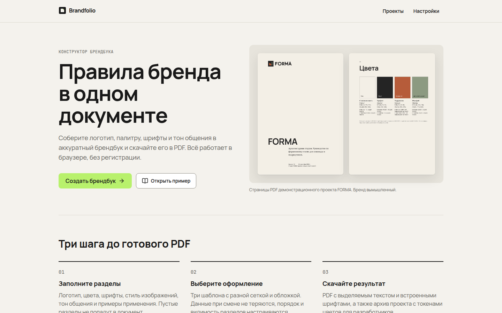
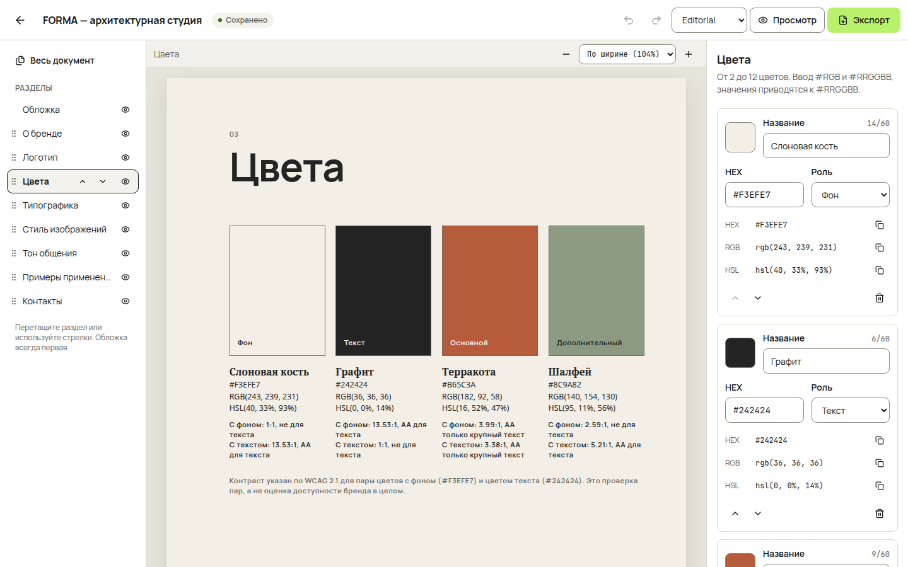
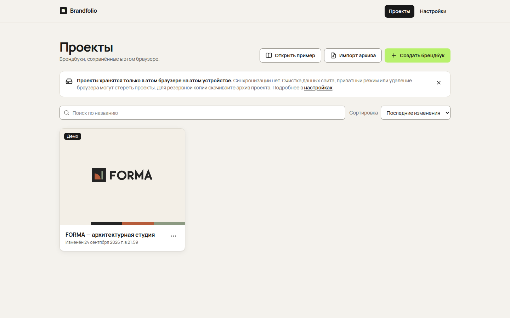
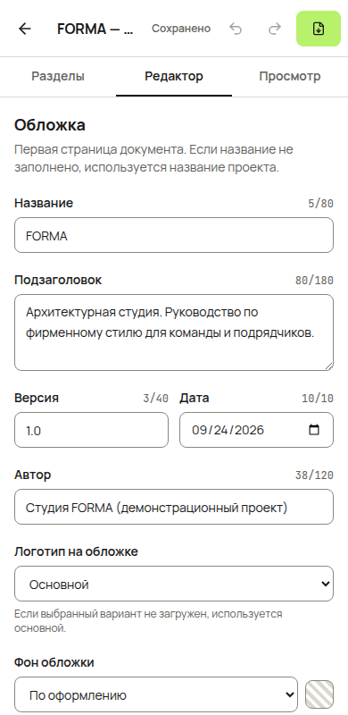
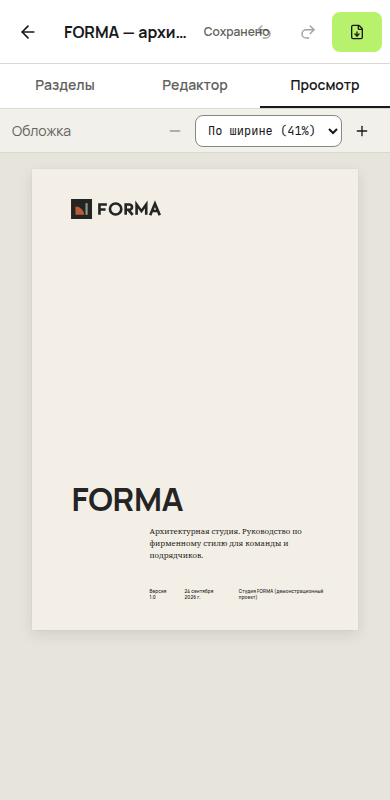

# Brandfolio

Веб-приложение для создания брендбуков. Пользователь описывает бренд (логотипы, цвета, шрифты, стиль изображений, тон общения, примеры применения, контакты), выбирает одно из трёх оформлений и скачивает PDF или переносимый архив `.brandfolio.zip`. Учётной записи и сервера нет: проекты хранятся в браузере на текущем устройстве.



## Команды

Нужен Node.js 22+.

```bash
npm ci                 # установка по lockfile
npm run dev            # http://localhost:5173
npm run build          # typecheck + production build в dist/
npm run preview        # раздача dist/ с SPA fallback
npm run typecheck
npm run lint           # oxlint
npm test               # unit и integration (Vitest)
npm run test:e2e       # Playwright, поднимает dev-сервер на :4173
python3 scripts/check-pdf.py file.pdf   # проверка PDF на выход текста за край и наложения (PyMuPDF)
npm run fonts          # пересборка шрифтов из исходников Google Fonts (нужны Python и fonttools)
```

Если Chromium для Playwright уже установлен в системе, путь к нему можно передать через `PW_CHROMIUM=/path/to/chromium npm run test:e2e`.

## Что внутри

| Маршрут | Страница |
| --- | --- |
| `/` | Главная: реальные страницы PDF демо-проекта, процесс, варианты оформления, ответы о хранении и экспорте |
| `/projects` | Проекты: поиск без учёта регистра, сортировка, создание, импорт архива, открыть пример, дублирование, удаление с подтверждением |
| `/editor/:projectId` | Редактор: разделы, рабочий лист, инспектор; на ширине меньше 1024 px — вкладки «Разделы / Редактор / Просмотр» |
| `/preview/:projectId` | Полноэкранный просмотр без панелей |
| `/settings` | Язык интерфейса, хранение, запрос постоянного хранения, резервные копии, оформление по умолчанию |

Неизвестный маршрут и отсутствующий проект показывают экраны восстановления со ссылкой на список проектов.

## Языки

- **Интерфейс**: русский, узбекский (латиница) и английский. При первом визите язык берётся из настроек браузера (иначе русский), переключатель есть в шапке и в настройках, выбор запоминается в `localStorage`.
- **Документ**: у каждого проекта своё поле `language` (схема v2). Оно задаёт язык подписей внутри брендбука (заголовки разделов, подписи, даты), PDF получает соответствующий `/Lang`. Тексты пользователя не переводятся. Проекты v1 при открытии и импорте получают `language: 'ru'`.
- **Устройство** (`src/i18n`): сообщения лежат в `messages/<раздел>.ts`, русский — источник; `defineMessages` требует от узбекского и английского те же ключи и сигнатуры, поэтому пропущенный перевод — ошибка типов. В компонентах `useMessages(...)`, вне React `msg(...)`, множественное число через `plural()` на `Intl.PluralRules`.
- В узбекском тексте используются `‘` (U+2018) в o‘/g‘ и `’` (U+2019) для тутук белгиси: в Manrope нет `ʻ` и `ʼ`.

## SEO и аналитика

- `index.html`: description, canonical, Open Graph и Twitter-карточка (`public/og-image.jpg`), JSON-LD `WebApplication`, `manifest.webmanifest` и иконки. `public/robots.txt` закрывает `/editor/` и `/preview/` (там только локальные проекты посетителя), `public/sitemap.xml`. Картинку и иконки пересобирает `node scripts/build-social.mjs`.
- Аналитика без cookies (`src/lib/analytics.ts`) выключена, пока в репозитории не заданы переменные Actions `ANALYTICS_PROVIDER` (`umami` или `plausible`), `ANALYTICS_SRC` (адрес скрипта) и `ANALYTICS_ID` (website id Umami или домен для Plausible). Помимо просмотров страниц отправляются события без содержимого проектов: `project_created`, `demo_opened`, `pdf_exported`, `archive_exported`, `archive_imported`, `template_changed`, `document_language_changed`, `interface_language_changed`. При `Do Not Track` скрипт не загружается.

## Архитектура

```
src/
  domain/      модель без React и хранения: Zod-схемы, миграции, цвета и контраст, лимиты, операции над проектом, remap ID
  storage/     Dexie (IndexedDB): проекты и ассеты, ревизии, конфликт вкладок, сборка мусора
  features/
    assets/    приём файлов: определение типа по байтам, лимиты, очистка SVG, растеризация
    editor/    Zustand-стор, история (undo/redo), очередь автосохранения, панели инспектора
    brandbook/ общий BrandbookViewModel и полноэкранный просмотр
    export/    PDF, ZIP-экспорт и импорт, токены, имена файлов
    demo/      демо-проект FORMA и его собственная графика
    projects/, settings/, home/
  templates/   стили шаблонов и два рендера одного view model: html/ (редактор, просмотр) и pdf/ (react-pdf)
e2e/           Playwright-сценарии
scripts/       сборка шрифтов, проверка PDF
```

Основные решения:

- **Одна модель, два рендера.** `buildViewModel(project, assetMetas)` превращает проект в `BrandbookViewModel`: токены цвета и шрифтов, разделы в порядке пользователя, признаки пустых разделов, список нужных ассетов. HTML-шаблон и PDF-шаблон рисуют один и тот же view model по общим параметрам `templates/templateStyle.ts` (поля, колонки, масштаб заголовков, вариант обложки). Пустые разделы в документ не попадают, экспорт сообщает, какие пропущены.
- **Документ без Blob.** Проект — сериализуемый JSON; ассеты упоминаются по ID и лежат в отдельной таблице. Все ссылки на цвета и ассеты проверяются схемой (`findBrokenReferences`), поэтому сохранить или импортировать проект с битой ссылкой нельзя.
- **Миграции.** `migrateProject` последовательно поднимает документ до текущей `schemaVersion` и валидирует его. Документ новее поддерживаемой версии отклоняется с объяснением.
- **Сохранение.** Правки попадают в историю (50 шагов, подряд идущие правки одного поля в пределах 1,5 с объединяются), автосохранение срабатывает через 600 мс. Каждое сохранение проверяет ревизию в той же транзакции: если проект уже сохранили в другой вкладке, автосохранение останавливается и предлагает «Сохранить мою версию как копию» или «Загрузить свежую версию». Ошибка записи (например, нехватка места) показывается в шапке и не сбрасывается следующей правкой, пока пользователь не нажмёт «Повторить». Статусы доступны через live region: ошибки сразу, «Сохранено» не чаще раза в 15 с.
- **PDF.** `@react-pdf/renderer` 4.9 в браузере, модуль загружается только при открытии экспорта (около 1,2 МБ). PDF строится из неизменяемого снимка проекта на момент нажатия, поэтому правки во время генерации не смешиваются с документом; диалог сообщает, если после генерации проект изменился. Предпросмотр на десктопе показывает тот же Blob, который скачивается. Размеры из интерфейса переводятся в pt как `px × 72 / 96`. Шрифты встраиваются подмножествами, текст выделяется и копируется, в метаданных есть название, автор и язык.
- **Контраст** считается по WCAG 2.x. Решение pass/fail принимается по точному коэффициенту, для показа коэффициент усекается до двух знаков, чтобы 4.499 не выглядело как 4.5. В формуле линеаризации sRGB показатель 2.4, как в WCAG (в тексте ТЗ указано `^2`, это опечатка).
- **SVG** — отдельная граница безопасности (`features/assets/svgSanitizer.ts`). Файл разбирается и пересобирается по allowlist элементов и атрибутов. Запрещены script, обработчики событий, foreignObject, внешние ссылки, CSS `url()` кроме `url(#id)`, DOCTYPE и сущности; ограничены размер, число элементов и вложенность. Файлы с текстом, фильтрами, встроенными растрами или `<style>` отклоняются с предложением загрузить PNG. В интерфейсе очищенный SVG показывается только через ``, в PDF — растровая копия 1600 px.
- **Интерфейс и документ разделены.** Токены интерфейса (`src/index.css`) не зависят от цветов бренда; акцент `#B8F16C` используется только как заливка с тёмным текстом, границы контролов `#8A877E` для контраста не ниже 3:1.

## Хранение и перенос

- Проекты и файлы лежат в IndexedDB этого браузера на этом устройстве. Синхронизации нет. Очистка данных сайта, приватный режим или нехватка места могут удалить проекты; приложение говорит об этом на странице проектов и в настройках.
- В настройках можно попросить браузер не удалять данные (`navigator.storage.persist()`); результат показывается честно, отказ браузера — обычная ситуация.
- **Архив `.brandfolio.zip`** содержит `project.json` (манифест, версия схемы, список ассетов с SHA-256 и сам проект), файлы `assets/`, `tokens.json`, `tokens.css` с CSS-переменными цветов и шрифтов и `README.txt`. Архив скачивается из редактора, списка проектов и раздела «Резервные копии» в настройках.
- **Импорт** всегда создаёт новый проект с новыми ID и ничего не меняет в существующих. Архив распаковывается потоково с проверкой лимитов во время распаковки; каждый файл проверяется как при обычной загрузке (тип по байтам, размер, очистка SVG, декодирование) и сверяется с контрольной суммой. В базу проект записывается одной транзакцией только после полной проверки, поэтому ошибочный архив не оставляет частичных записей.
- Имена скачиваемых файлов транслитерируются в ASCII: Chromium игнорирует атрибут `download` с кириллицей и сохраняет файл как `download`.

## Лимиты

| Что | Лимит |
| --- | --- |
| Логотип или изображение | PNG, JPEG (и SVG для логотипов), до 5 МиБ и 20 мегапикселей |
| SVG | до 1 МиБ, 5000 элементов, вложенность 64 |
| Палитра | от 2 до 12 цветов |
| Изображения в разделе «Стиль изображений» | до 6 |
| Тексты | заголовок 80, подзаголовок 180, длинный текст 4000, пункт списка 300, подпись 200 символов |
| Списки | ценности и правила до 12, пары «так / не так» до 8, «можно / нельзя» до 8 |
| Архив при импорте | до 40 МиБ, распакованный до 100 МиБ, до 100 файлов, `project.json` до 2 МиБ |
| История правок | 50 шагов, не переживает перезагрузку |

## Размещение

Это SPA: любой неизвестный путь должен отдавать `index.html`, иначе перезагрузка `/editor/...` вернёт 404.

- `npm run preview` уже делает это для `dist/`.
- Netlify: `public/_redirects` (`/* /index.html 200`) попадает в сборку.
- Vercel: `vercel.json` с rewrite на `/index.html`.
- nginx: `location / { try_files $uri /index.html; }`.
- **brandfolio.uz** (сервер Hetzner): `.github/workflows/deploy.yml` собирает сайт и по SSH выкладывает релиз в `/var/www/brandfolio` (три последних релиза хранятся, переключение через симлинк). При первом запуске `scripts/deploy-remote.sh` ставит nginx и certbot, если их нет, создаёт сайт nginx с SPA fallback и получает сертификат Let's Encrypt. Нужны секреты `SSH_HOST`, `SSH_USER`, `SSH_PRIVATE_KEY`; без них деплой пропускается.
- GitHub Pages: `.github/workflows/pages.yml` собирает сайт с `BASE_PATH=/brandfolio/`, копирует `index.html` в `404.html` (у Pages нет rewrites) и публикует ветку `gh-pages`. Адрес: https://boldpunk.github.io/brandfolio/ после выбора ветки `gh-pages` в Settings → Pages.
- Для размещения в подкаталоге соберите с `BASE_PATH=/path/ npm run build`: пути к ресурсам и маршрутизация берут базу из этой переменной.

## Демо-проект

«FORMA — архитектурная студия» — вымышленный бренд, помеченный как демонстрационный. Знак, логотипы и три композиции вместо фотографий нарисованы для этого проекта (`features/demo/formaAssets.ts`), контакты на `example.com`. Кнопка «Открыть пример» создаёт пользовательскую копию и при повторном нажатии открывает её же, не перезаписывая правки. Новый проект создаётся пустым с подсказками.

Примеры результата: [docs/samples](docs/samples) — PDF в трёх оформлениях и архив проекта.

## Проверки и результаты

Запуск 24.09.2026, Chromium (Playwright 1.63), Linux.

| Проверка | Результат |
| --- | --- |
| `npm run typecheck` | без ошибок |
| `npm run lint` | 0 ошибок, 18 предупреждений oxlint (`set-state-in-effect`, `only-export-components`) |
| `npm test` | 11 файлов, 90 тестов, все прошли |
| `npm run build` | собирается; предупреждение о размере lazy-чанка PDF |
| `npm run test:e2e` | 7 сценариев, все прошли |
| `scripts/check-pdf.py` | 0 проблем в трёх PDF демо и трёх стресс-PDF |

Unit и integration: цвета и контраст (пороги 4.5 и 3 без округления), схемы и миграции, remap ID, операции над разделами и палитрой, история, очередь сохранения (ошибка, конфликт, невалидный документ), хранилище на fake-indexeddb (ревизии, дубли, сборка мусора, отказ без частичной записи), приём файлов и очистка SVG, архив (round-trip, обход путей, zip-бомба, лимит числа файлов, новая версия схемы, отсутствующий или подменённый файл, битые ссылки), имена файлов, мягкие переносы.

E2E (`e2e/`): создание → правка → перезагрузка → экспорт PDF; экспорт архива и импорт в чистый профиль браузера; сохранение из второй вкладки обнаруживается как конфликт, копия сохраняется; ошибка записи показывается и повторяется; отсутствие горизонтального скролла на 360, 390, 768, 1024, 1440 px на всех страницах; сценарий на 390 px только с клавиатуры (создание, правка, просмотр, undo); стресс-проект в трёх оформлениях.

PDF каждого шаблона отрендерены постранично (PyMuPDF) и просмотрены. Стресс-проверка нашла и помогла исправить три дефекта: наложение пунктов длинного списка на переносе страницы, вылет длинных имён цветов за плитку, перенос обложки с очень длинным названием на вторую страницу.

Скриншоты: [docs/screens](docs/screens).

| | |
| --- | --- |
|  |  |
|  |  |

## Требования ТЗ

| ID | Сценарий | Реализовано | Проверено | Ограничение |
| --- | --- | --- | --- | --- |
| A01 | Правки текста и палитры переживают перезагрузку | да | e2e `core`, unit хранилища | — |
| A02 | Дубль независим, удаление копии не трогает оригинал | да | unit хранилища | — |
| A03 | Три шаблона, скрытие и перестановка разделов, PDF отражает структуру | да | unit операций, ручной экспорт трёх шаблонов | нет автоматической проверки порядка разделов внутри PDF |
| A04 | Undo/redo после цвета, текста, перемещения раздела | да | unit истории, e2e undo на 390 px | история не сохраняется между перезагрузками |
| A05 | Ошибочный HEX, битый файл, неподдерживаемый SVG | да | unit цветов, приёма файлов и SVG | — |
| A06 | 21:1 и 1:1, пороги без округления | да | unit контраста | — |
| A07 | Кириллица, узбекская латиница, прозрачный логотип в PDF | да | ручная проверка PDF, встроенные шрифты | в Manrope нет `ʻ` (U+02BB), редактор предупреждает; использовать `‘` (U+2018) |
| A08 | Максимальные тексты, длинные слова и URL, 12 цветов, 6 изображений | да | e2e `stress` + `check-pdf.py` + просмотр страниц | принудительный перенос внутри длинного слова или URL в PDF рисует `-` |
| A09 | ZIP в чистом профиле браузера | да | e2e `core`, unit round-trip | — |
| A10 | Ошибочная схема, нет ассета, превышен лимит — без частичных записей | да | unit архива и хранилища | — |
| A11 | Ошибка сохранения и конфликт вкладок без ложного успеха | да | e2e `resilience`, unit очереди | — |
| A12 | Клавиатура и 390 px: создание, правки, просмотр, скачивание | да | e2e `responsive`, скриншоты | на телефоне PDF не встраивается в диалог, открывается отдельно; проверено в эмуляции Chromium, не на реальных устройствах |
| A13 | Правки во время генерации не попадают в PDF | да (снимок проекта) | ревью кода | нет автоматического теста |

## Известные ограничения

- e2e идут в CI в Chromium, Firefox и WebKit (движок Safari); на реальных устройствах Apple не проверялось.
- Экранная клавиатура телефона проверена только эмуляцией; поведение на реальных iOS и Android не проверено.
- Lighthouse и аудит скринридером не запускались.
- HTML-вид в редакторе близок к PDF, но переносы строк и разбивка на страницы могут отличаться; точный вид — предпросмотр в диалоге экспорта.
- В PDF длинные слова и URL без пробелов переносятся принудительно, и react-pdf рисует в месте переноса дефис.
- react-pdf 4.9 в браузере пишет в консоль `Buffer is not defined` для каждого изображения; на результат не влияет.
- Пользовательские шрифты не поддерживаются (отложено до следующей версии); доступны Manrope, Noto Sans и Noto Serif в начертаниях 400/600/700 (Noto Serif 400/700), вес выбирается ближайший.
- Синхронизации между устройствами нет, перенос — только через архив.

## Лицензии

- Шрифты Manrope, Noto Sans, Noto Serif и JetBrains Mono распространяются по SIL Open Font License 1.1. Тексты лицензий лежат в `public/fonts/*-OFL.txt`, источники и контрольные суммы — в `public/fonts/fonts.json`.
- Логотипы и композиции демо-проекта FORMA, а также изображения в `public/examples` созданы для этого проекта.
- Иконки интерфейса — Lucide (ISC).
